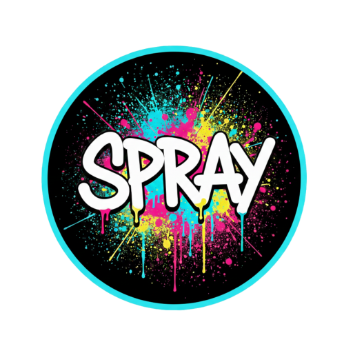
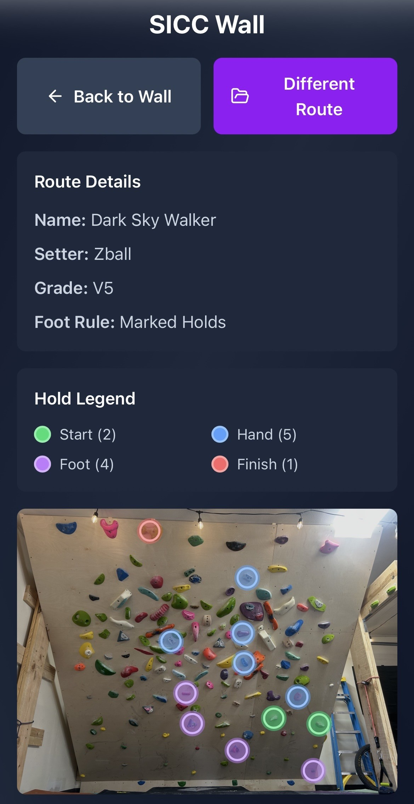

<p align="center">
  
  <br> <!-- Optional line break -->
</p>

# Intro

A React web-based app allowing users to build and save climbing routes for their own custom climbing walls.

Spray works in a very simple way:

1) Upload an image of your climbing wall.
2) Create routes by clicking/pressing on holds in your image to generate markers.
3) Save the route, along with route name, setter name, V-grade difficulty, foot rule, and any special notes.
4) View the route again at any time!

That's it! No user profiles, no ascent logging, just a simple app to maintain a library of routes for your climbing wall.

It might be hard to use for walls with very dense hold layouts since the markers may cover multiple holds, but hey, it gets the job done for me, and maybe it will for you too! Below is a screenshot from my iPhone 14 showing one of the routes I created and saved:



## Disclaimer

**I am not an app developer!** Most of the code here was developed using AI tools as a fun way to learn how to use said tools and make something useful for myself. Also, I have only run this app on a Linux machine, so I make no promises whether it will work on Mac or Windows devices. Once the app is running, though, and served through a local network, it should be accessible from any kind of device (phone, tablet, computer) connected to the same network using your choice of web browser.

## Requirements

You will need to have the following software installed on your machine in order to properly run and serve this app on your local network:

* Node.js
    * `sudo apt install nodejs`
* npm
    * `sudo apt install npm`

## Getting Started

Start by cloning this repository onto your own machine:

```bash
git clone https://github.com/zvanderbosch/spray.git
```

Move into the **spray** directory and then install all of the necessary packages with **npm**:

```bash
cd spray
npm install
```

Create a **db.json** file in the **spray** directory with the following contents:

```json
{
    "walls": [],
    "routes": []
}
```

This file will serve as the database storing your library of climbing walls and associated routes. You will also need to create a **.env** file in the **spray** directory with the following contents:

```javascript
VITE_API_URL=http://YOUR_COMPUTER_IP:3001
```

Replace `YOUR_COMPUTER_IP` with your computer's local IP address. You can find this IP address from the terminal using one of the following commands:

```bash
ip address | grep inet
ifconfig -a | grep inet
hostname -I
```

If you are still not sure what IP address to use, you can also try running `npm run dev` which will print out the IP address being used to serve the app:

```
  ➜  Network: http://YOUR_COMPUTER_IP:3000/
```

## Running the App

With the above steps complete, simply run the following from your **spray** directory:

```bash
npm run dev:all
```

Now, any device that is connected to the same network as the device that's running the app will be able to access the app on a browser at the **Network** address printed out on the terminal, such as:

```
  VITE v7.3.1  ready in 121 ms

  ➜  Local:   http://localhost:3000/
  ➜  Network: http://YOUR_COMPUTER_IP:3000/
  ➜  press h + enter to show help
```

To shut down the app and database server, just type `ctrl+c` in the terminal running the app.