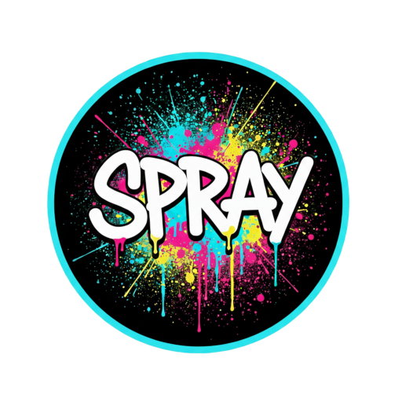
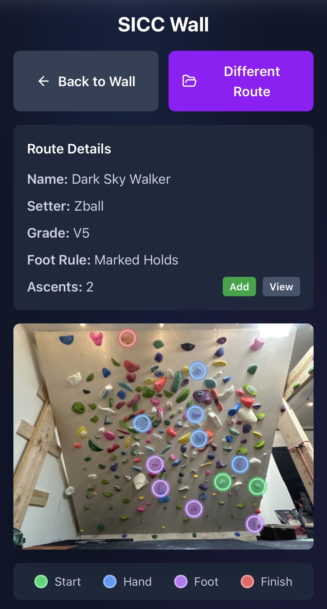

<p align="center">
  
</p>

#

A React web-based app allowing users to build and save climbing routes for their own custom climbing walls.

Spray works in a very simple way:

1) Upload an image of your climbing wall.
2) Create routes by clicking/pressing on holds in your image to generate markers.
3) Save the route, along with route name, setter name, V-grade difficulty, foot rule, and any special notes.
4) View the route again at any time!
5) Record ascents if you'd like, logging just your name and ascent date.

That's it! No user profiles, just a simple app to maintain a library of routes for your climbing wall.

It might be hard to use for walls with very dense hold layouts since the markers may cover multiple holds, but hey, it gets the job done for me, and maybe it will for you too! Below is a screenshot from my iPhone 14 showing one of the routes I created and saved:



## Disclaimer

**I am not a professional or aspiring app developer!** Most of the code here was developed using AI tools (Claude) as a fun way to learn how to use said tools and make something useful for myself. Also, I have only served this app using a Linux machine, so I make no promises whether it can be served on Mac or Windows devices. Once the app is running, though, and served through a local network, it should be accessible from any kind of device (phone, tablet, computer) connected to the same network using your choice of web browser. It is also possible to make the app publicly available with tools like [ngrok](https://ngrok.com/) if you so desire.

## Getting Started

If you don't already have **Node.js** and **npm** installed, you will need them. Do not use `apt` to install these, though, since `apt` typically installs much older versions. There are a few options out there, but I used [Node Version Manager (NVM)](https://github.com/nvm-sh/nvm?tab=readme-ov-file). Once NVM in installed, you can install the latest Node.js and npm versions with:

```bash
nvm install node
```

Now clone this repository onto your own machine:

```bash
git clone https://github.com/zvanderbosch/spray.git
```

Move into the **spray** directory and then install all of the necessary packages with **npm**:

```bash
cd spray
npm install
```

Create a **db.json** file in the **spray** directory with the following contents:

```json
{
    "walls": [],
    "routes": []
}
```

This file will serve as the database storing your library of climbing walls and associated routes.

## Serving the App

With the above steps complete, simply run the following from your **spray** directory:

```bash
npm run dev:all
```

Now, any device that is connected to the same network as the device that's running the app will be able to access the app on a browser at the **Network** address printed out on the terminal, such as:

```
  VITE v7.3.1  ready in 121 ms

  ➜  Local:   http://localhost:3000/
  ➜  Network: http://YOUR_COMPUTER_IP:3000/
  ➜  press h + enter to show help
```

To shut down the app and database server, just type `ctrl+c` in the terminal running the app.

## Making the App Publicly Available

If you want to allow people to access your app publicly from any device or internet connection, you can use tools like [ngrok](https://ngrok.com/). All ngrok accounts get one free public domain, although these free domain names are randomly generated by ngrok and cannot be customized without paying a monthly or annual fee. I set this up for my instance of the app, though, using the free domain name and it seems to be working great.